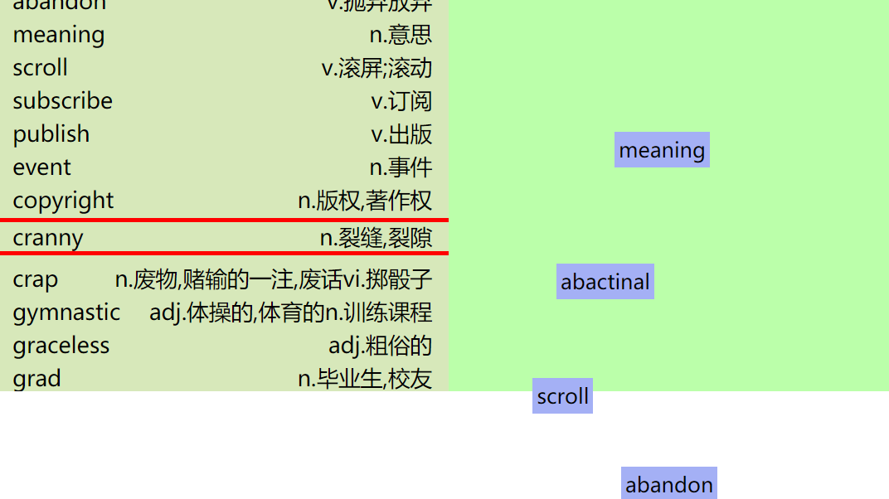

# todo 
- - [ ] 0t1、移动不能超过规定区域
- - [ ] 0t2、单词是recite的单词显示中文，其他的显示音标
- - [ ] 0t3、长按某个单词可以所有单词出现一个删除的x 
# bug todo 
- - [ ] 0b1、在大的视口范围输入单词，当视口缩小时，右边还可以滑动，会出现如下
- - [ ] Ob2、双击right的时候，会有一个判断，这个判断是根据有无input来进行的，这样如果页面中有一个input元素都使双击失效。。。在input输入框加入id。

